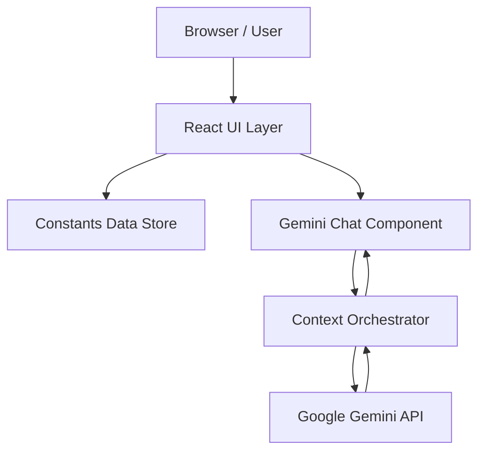

# Alex Mercer | AI Engineer Portfolio

[](https://react.dev/)
[](https://ai.google.dev/)
[](https://tailwindcss.com/)
[](https://opensource.org/licenses/MIT)

A premium, cinematic portfolio designed for a Senior AI Engineer specializing in LLM orchestration, agentic workflows, and scalable ML systems. This project serves as both a professional showcase and a live demonstration of modern AI integration, featuring a specialized Gemini-powered digital assistant that provides contextual insights into the engineer's background.

---

## ✨ Key Features

- **Interactive AI Assistant**: A custom-trained digital twin powered by **Gemini 2.5 Flash**, capable of answering technical questions about specific projects, architectural decisions, and professional history.
- **Cinematic UI/UX**: High-fidelity visual design with dynamic background ambience, animated noise overlays, and organic gradient blobs for a futuristic feel.
- **Production-Grade Architecture**: Clean, modular React component structure with centralized data management via `constants.ts`.
- **System-Aware Grounding**: The AI agent is grounded in professional metadata including skills, experience, and project impact metrics to ensure deterministic and accurate responses.
- **Mobile-Responsive Engineering**: Fully fluid layouts designed for high-end displays and mobile devices alike.

---

## 🛠 Tech Stack

### Frontend
- **React 19**: Utilizing the latest concurrent rendering features.
- **Tailwind CSS**: Utility-first CSS framework for rapid UI development.
- **Lucide React**: Clean, consistent iconography.
- **Space Grotesk & Inter**: Modern typography pairing for high readability and technical aesthetic.

### AI & API
- **Google GenAI SDK (`@google/genai`)**: Native integration with Gemini models.
- **Gemini 2.5 Flash**: Optimized for low-latency, high-context conversational interfaces.

### Hosting & Infrastructure
- **Vercel/Netlify**: Optimized for SPA deployment.
- **ESM Modules**: Modern browser-native module loading.

---

## 🏗 Architecture

The application follows a decoupled Frontend-First architecture:



### AI Agent Workflow
1. **Context Loading**: The agent ingests project data, skill sets, and professional history from `constants.ts` upon initialization.
2. **Instruction Grounding**: System instructions ensure the agent remains professional and strictly adheres to facts within the provided portfolio scope.
3. **Real-time Inference**: User queries are processed via the `@google/genai` SDK using a flash-tier model to ensure sub-second response times.

---

## 🚀 Installation & Setup

### Prerequisites
- A modern browser with ES6 module support.
- A **Google Gemini API Key**. Get one at [Google AI Studio](https://aistudio.google.com/).

### Local Setup Instructions
1. **Clone the repository**
   ```bash
   git clone https://github.com/your-username/ai-engineer-portfolio.git
   cd ai-engineer-portfolio
   ```

2. **Configure Environment Variables**
   The application expects an API key for the Gemini integration. Ensure your development environment provides:
   ```env
   API_KEY=your_gemini_api_key_here
   ```

3. **Serve the Application**
   Since this project uses native ESM imports, you can serve it with any static server:
   ```bash
   npx serve .
   ```

---

## 📖 Usage

- **Hero Section**: Explore the high-level focus on intelligent systems.
- **AI Assistant**: Click the `Cpu` icon in the bottom right corner to initiate a technical conversation with the Gemini agent.
- **Technical Capabilities**: Review the deep-dive skill set spanning MLOps to LLM architecture.
- **Deployments**: View detailed problem-solution-impact case studies of past engineering projects.

---

## 🗺 Roadmap

- [ ] **Vector Search (RAG)**: Transition from context-injection to true RAG for larger document bases.
- [ ] **Interactive Case Studies**: Add expandable code snippets and architecture diagrams.
- [ ] **Multi-modal Support**: Allow users to upload system diagrams for the AI agent to analyze.
- [ ] **Dark/Light Mode**: Automatic system-theme detection.

---

## 🤝 Contributing

Contributions are welcome! Please follow these steps:
1. Fork the Project.
2. Create your Feature Branch (`git checkout -b feature/AmazingFeature`).
3. Commit your Changes (`git commit -m 'Add some AmazingFeature'`).
4. Push to the Branch (`git push origin feature/AmazingFeature`).
5. Open a Pull Request.

---

## 📄 License

Distributed under the MIT License. See `LICENSE` for more information.

---

## 📬 Contact

**Alex Mercer** - Senior AI Engineer  
[LinkedIn](https://linkedin.com/) | [GitHub](https://github.com/) | [Email](mailto:alex@example.com)

Project Link: [https://github.com/your-username/ai-engineer-portfolio](https://github.com/your-username/ai-engineer-portfolio)
